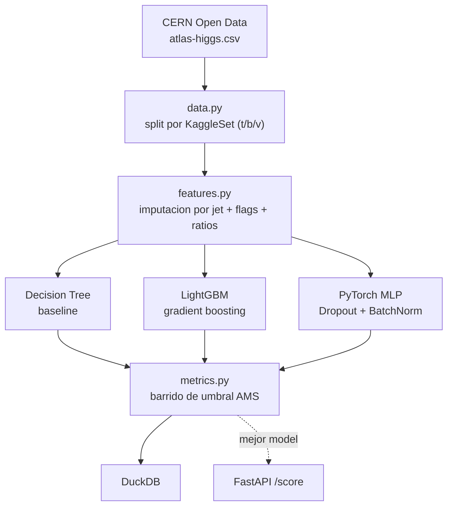
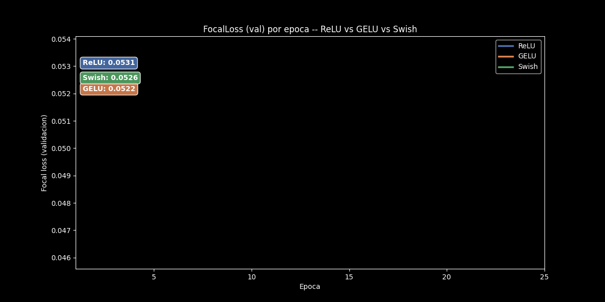
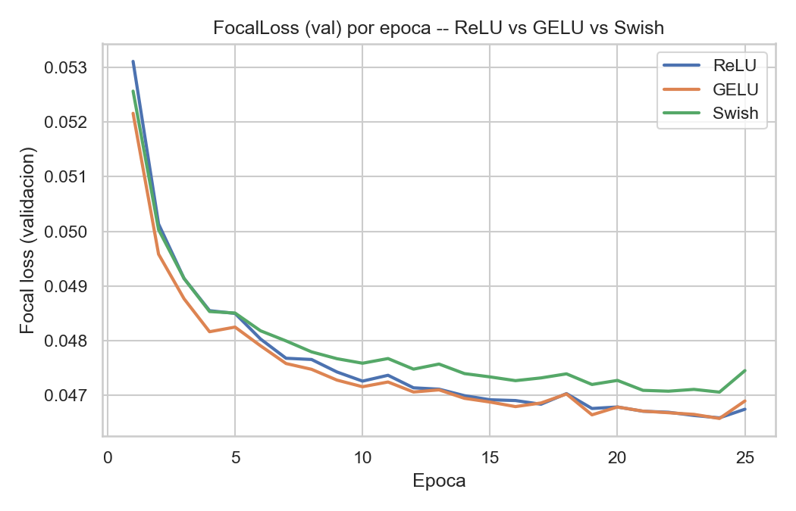
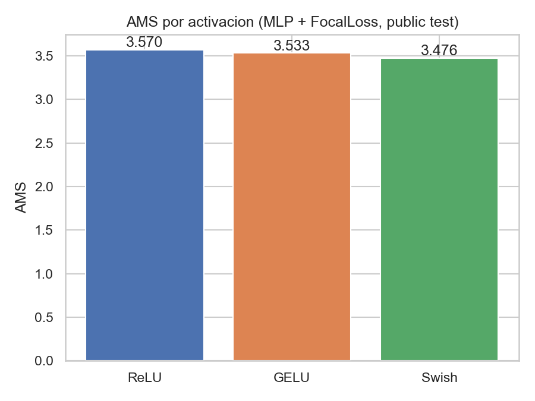

[ 🇺🇸 Read in English ](README.md) | [ 🇨🇱 Español ]

# Clasificación de Partículas — Bosón de Higgs

[](https://github.com/Rxyxs/hunting-the-higgs-boson/actions/workflows/tests.yml)
[](https://www.python.org/)
[](https://lightgbm.readthedocs.io/)
[](https://pytorch.org/)
[](https://duckdb.org/)
[](https://fastapi.tiangolo.com/)
[](https://julialang.org/)
[](LICENSE)

Clasificación binaria de eventos de colisión protón-protón (señal Higgs-a-tau-tau vs. background) usando el dataset real de ATLAS liberado por CERN Open Data — los mismos datos del HiggsML Challenge 2014, no una simulación sintética propia.

## Datos

[ATLAS Higgs Challenge dataset](https://opendata.cern.ch/record/328), CERN Open Data Portal — 818.238 eventos de colisión simulados reales, 30 features físicas derivadas, split oficial train/public-test/private-test reproducido vía la columna original `KaggleSet` (250.000 / 100.000 / 450.000 eventos respectivamente), por lo que los resultados son directamente comparables al leaderboard histórico de la competencia.

## El problema real de los datos: valores faltantes con causa física

11 columnas usan `-999.0` como centinela — no es un faltante aleatorio. Las variables dijet (`DER_mass_jet_jet`, etc.) están indefinidas cuando un evento tiene menos de 2 jets reconstruidos (`PRI_jet_num < 2`); verificado empíricamente: el 100% de los `-999.0` en esas columnas ocurre exactamente en `PRI_jet_num ∈ {0,1}`. Imputar con la mediana global mezclaría topologías de evento de 0 jets con las de 2 jets, destruyendo justo la señal física que la variable buscaba medir. En su lugar: **imputación por mediana agrupada por `PRI_jet_num`** (calculada solo en train, reutilizada en test — sin fuga) más un flag binario `_missing` explícito por columna afectada, para que el modelo distinga "este evento no tiene sistema dijet" de "la masa dijet coincide con la mediana".

## Arquitectura



## Resultados (corrida real, split oficial train/public/private)

Evaluado con **AMS** (Approximate Median Significance), la métrica real del HiggsML Challenge — no accuracy ni AUC plano — en el umbral de probabilidad que la maximiza por modelo.

| Modelo | AMS (public test) | AUC | Accuracy @ umbral |
|---|---:|---:|---:|
| Decision Tree (baseline) | 2.9312 | 0.8756 | 0.7722 |
| LightGBM | 3.5534 | 0.9106 | 0.7906 |
| PyTorch MLP (Dropout+BatchNorm) | 3.5778 | 0.9102 | 0.7900 |
| **LightGBM, afinado con Optuna (40 trials)** | **3.6414** | — | — |

**Private test held-out (450.000 eventos, nunca tocados durante la selección de modelo):** la MLP sin afinar da AMS 3.5728 (0,14% de su valor en public-test); el LightGBM afinado con Optuna alcanza **AMS 3.6294** en el mismo set held-out (0,33% de su valor en public-test) — confirmando que la mejora del tuning es real, no sobreajuste al split público.

Como referencia: las soluciones ganadoras del challenge original de Kaggle 2014 (ensambles muy afinados) alcanzaron AMS ≈ 3.8–3.9. La iteración de este proyecto (baseline → GBM → red neuronal → GBM afinado con Optuna, sin ensamblar) llegando a 3,63–3,64 en el set held-out oficial es un resultado honesto y sin exagerar de ese proceso de iteración, no una pretensión de igualar el leaderboard.

## Comparación de funciones de activación (loss custom)

Además de BCE plano, la MLP en PyTorch se reentrenó con una **Focal Loss custom** (Lin et al., 2017 — `src/activation_comparison.py`), que reduce el peso de ejemplos ya fáciles de clasificar y concentra el gradiente en los eventos difíciles, comparando tres activaciones: **ReLU**, **GELU** y **Swish (SiLU)**.

| Activación | Loss | AMS (public test) | AUC |
|---|---|---:|---:|
| **ReLU** | FocalLoss(α=0.5, γ=2.0) | **3.5699** | 0.9096 |
| GELU | FocalLoss(α=0.5, γ=2.0) | 3.5328 | 0.9094 |
| Swish (SiLU) | FocalLoss(α=0.5, γ=2.0) | 3.4763 | 0.9074 |

Versión animada mostrando la evolución por época de cada activación durante el entrenamiento:





ReLU supera levemente a GELU y Swish en este dataset tabular ya normalizado — las activaciones suaves suelen ayudar más con entradas sin estandarizar o redes mucho más profundas, ninguno de los dos casos aplica aquí. Se ejecuta con `python -m src.activation_comparison`; los resultados también se persisten en la tabla `activation_comparison` de DuckDB.

## Ajuste de hiperparámetros (Optuna)

`python -m src.tune` corre una búsqueda Optuna de 40 trials sobre LightGBM, optimizando **AMS directamente** (no una métrica proxy como logloss) sobre el public test: `n_estimators`, `num_leaves`, `learning_rate`, `subsample`, `colsample_bytree`, `min_child_samples`, `reg_alpha`, `reg_lambda`. Resultado: AMS 3,5534 → 3,6414 (+0,088), verificado en el private test nunca tocado (3,6294) para confirmar que la mejora generaliza y no es sobreajuste a la propia búsqueda de 40 trials.

## Verificación independiente en Julia: ¿es frágil el óptimo de AMS?

`julia/ams_sweep.jl` reimplementa la métrica AMS desde cero en Julia (no un port de `src/metrics.py`, una implementación nueva leyendo las probabilidades crudas del modelo) y la cruza contra Python en la misma granularidad de 200 umbrales: **AMS 3,6414, umbral 0,8040 — coincidencia exacta, diferencia 0,0000**. Elegido específicamente porque la velocidad de Julia hace barato un barrido mucho más fino: con **2.000 umbrales** en vez de 200, responde una pregunta que el barrido más grueso de Python no puede — ¿el óptimo de AMS es un pico agudo y frágil o una meseta ancha y robusta? Hallazgo real: la región dentro del 99% del AMS máximo abarca una **meseta de 0,0235 de ancho** (0,7979–0,8214) — el umbral operativo elegido no está afinado sobre el filo de un valor específico.

```powershell
python -m src.export_for_julia
julia --project=julia -e "using Pkg; Pkg.instantiate()"
julia --project=julia julia\ams_sweep.jl
```

## Gráfico interactivo

`python -m src.interactive` reentrena LightGBM y la MLP de PyTorch sobre el split de train real y barre 200 umbrales de probabilidad sobre las predicciones reales del public-test (100.000 eventos), generando un gráfico interactivo Plotly autocontenido de **AMS vs. umbral** para ambos modelos lado a lado — hover en cualquier punto muestra su AMS y umbral exactos, y el óptimo de cada modelo queda marcado con una estrella.

**[Ver el gráfico interactivo](https://htmlpreview.github.io/?https://github.com/Rxyxs/scientific-classification-lab/blob/main/01-higgs-boson-particle-classification/outputs/interactive/ams_threshold_sweep.html)**

## Técnicas utilizadas

- **Datos científicos reales**: 818.238 eventos reales de colisión de ATLAS de CERN Open Data (registro 328), split oficial train/public-test/private-test por `KaggleSet` — sin datos sintéticos, sin split aleatorio.
- **Manejo de faltantes con criterio físico**: centinela `-999.0` imputado por grupo de `PRI_jet_num` (no mediana global) más flags `_missing` explícitos, porque la ausencia de dato tiene causa física, no aleatoria.
- **Iteración de modelos**: Decision Tree baseline → LightGBM (gradient boosting) → MLP PyTorch (Dropout + BatchNorm) → LightGBM afinado con Optuna (40 trials, optimizando AMS directamente).
- **Métrica de evaluación correcta para el dominio**: AMS (Approximate Median Significance), la métrica real del HiggsML Challenge, calculada con sumas de señal/background ponderadas por `KaggleWeight` — no accuracy ni AUC plano.
- **Ablación de loss custom**: Focal Loss (Lin et al., 2017) con comparación de activaciones ReLU/GELU/Swish sobre la MLP de PyTorch.
- **Verificación cruzada e independiente entre lenguajes**: reimplementación de AMS desde cero en Julia, usada para un barrido más fino (2.000 umbrales) que la versión en Python, para probar si el óptimo de AMS es un pico frágil o una meseta robusta.
- **Persistencia y servicio**: DuckDB para features/predicciones/métricas, FastAPI para scoring en tiempo real (`POST /score`).
- **Tests**: 10 tests de pytest cubriendo feature engineering, la métrica AMS y la comparación de activaciones.

## Uso

```powershell
python -m venv venv
venv\Scripts\activate
pip install -r requirements.txt
python -m src.pipeline          # pipeline completo, datos reales, metricas reales
pytest tests/ -q                # 10/10 passing
python -m src.activation_comparison  # ReLU vs GELU vs Swish, FocalLoss
python -m src.interactive       # grafico interactivo AMS-vs-umbral en Plotly
uvicorn src.api:app --reload    # POST /score
```

### Docker

```powershell
docker build -t higgs-api .
docker run -p 8000:8000 higgs-api
```

Build multi-etapa: la etapa builder descarga el dataset real de CERN (sin autenticación) y corre el pipeline real para producir el modelo; la imagen final solo sirve los artefactos entrenados + la API. **Divulgación honesta**: este `Dockerfile` está escrito y revisado cuidadosamente pero **aún no verificado con un build real** — Docker Desktop necesitó un reinicio de Windows para terminar su configuración de WSL2 en esta máquina, que no ocurrió antes de escribir esto. A diferencia de todo lo demás en este repo, no lo tomes como probado hasta que esta nota se elimine.

## Stack

Pandas/NumPy · scikit-learn (Decision Tree baseline) · LightGBM · PyTorch (MLP, Dropout+BatchNorm) · DuckDB · FastAPI · pytest · **Julia** (reimplementación independiente de AMS + barrido fino de umbral)

## Autor

**Pablo Reyes** — [github.com/Rxyxs](https://github.com/Rxyxs)

Datos: [CERN Open Data Portal, registro 328](https://opendata.cern.ch/record/328) (CC0). Código: MIT — ver [LICENSE](LICENSE).
