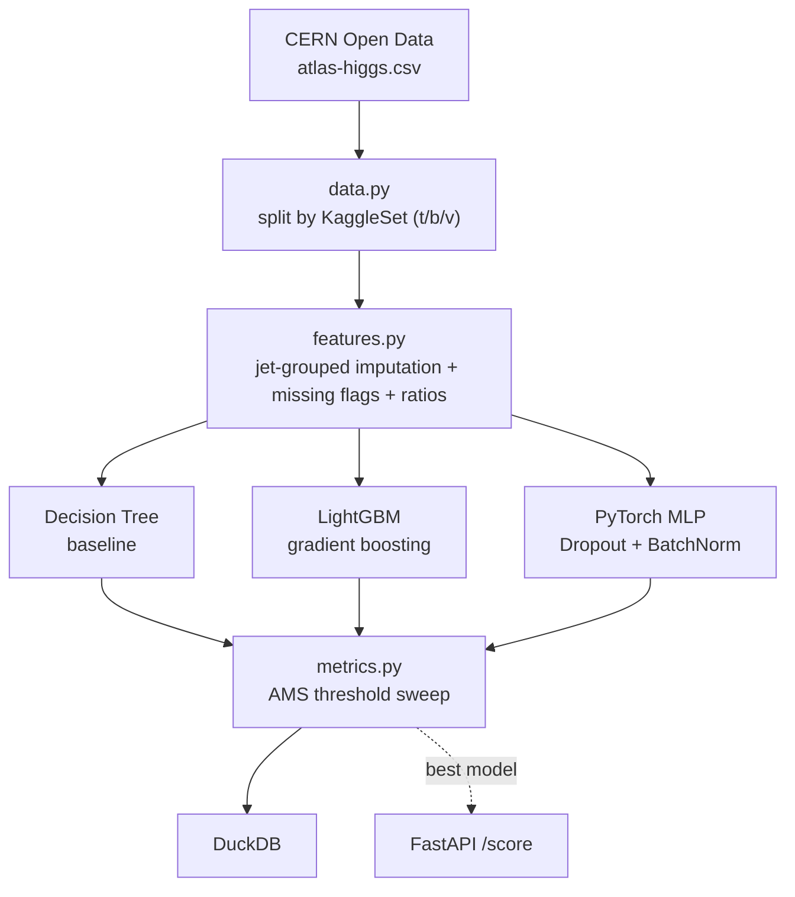

[ 🇺🇸 English ] | [ 🇨🇱 Leer en Español ](README.es.md)

# Higgs Boson Particle Classification

[](https://github.com/Rxyxs/hunting-the-higgs-boson/actions/workflows/tests.yml)
[](https://www.python.org/)
[](https://lightgbm.readthedocs.io/)
[](https://pytorch.org/)
[](https://duckdb.org/)
[](https://fastapi.tiangolo.com/)
[](https://julialang.org/)
[](LICENSE)

Binary classification of proton-proton collision events (Higgs-to-tau-tau signal vs. background) using the real ATLAS dataset released by CERN Open Data — the same data behind the 2014 HiggsML Challenge, not a synthetic simulation.

## Data

[ATLAS Higgs Challenge dataset](https://opendata.cern.ch/record/328), CERN Open Data Portal — 818,238 real simulated collision events, 30 physics-derived features, official train/public-test/private-test split reproduced via the original `KaggleSet` column (250,000 / 100,000 / 450,000 events respectively) so results are directly comparable to the historical competition leaderboard.

## The real-data problem: physically-defined missing values

11 columns use `-999.0` as a sentinel — not random missingness. Dijet variables (`DER_mass_jet_jet`, etc.) are undefined whenever an event has fewer than 2 reconstructed jets (`PRI_jet_num < 2`); verified empirically: 100% of `-999.0` in those columns occurs exactly at `PRI_jet_num ∈ {0,1}`. Imputing with the global median would blend 0-jet and 2-jet event topologies, destroying the physical signal the variable was measuring. Instead: **median imputation grouped by `PRI_jet_num`** (computed on train only, reused on test — no leakage) plus an explicit `_missing` binary flag per affected column, so the model can distinguish "this event has no dijet system" from "the dijet mass happens to equal the median."

## Architecture



## Results (real run, official train/public/private split)

Evaluated with **AMS** (Approximate Median Significance), the actual HiggsML Challenge metric — not accuracy or plain AUC — at the probability threshold that maximizes it per model.

| Model | AMS (public test) | AUC | Accuracy @ threshold |
|---|---:|---:|---:|
| Decision Tree (baseline) | 2.9312 | 0.8756 | 0.7722 |
| LightGBM | 3.5534 | 0.9106 | 0.7906 |
| PyTorch MLP (Dropout+BatchNorm) | 3.5778 | 0.9102 | 0.7900 |
| **LightGBM, Optuna-tuned (40 trials)** | **3.6414** | — | — |

**Held-out private test (450,000 events, never touched during model selection):** untuned MLP AMS 3.5728 (0.14% from its public-test value); the Optuna-tuned LightGBM reaches **AMS 3.6294** on the same held-out set (0.33% from its public-test value) — confirming the tuning gain is real, not overfit to the public split.

For reference: the original 2014 Kaggle challenge's winning solutions (heavily tuned ensembles) reached AMS ≈ 3.8–3.9. This project's iteration (baseline → GBM → NN → Optuna-tuned GBM, no ensembling) reaching 3.63–3.64 on the official held-out set is an honest, unexaggerated result of that iteration process, not a leaderboard-matching claim.

## Activation function comparison (custom loss)

To go beyond plain BCE, the PyTorch MLP was also retrained with a **custom Focal Loss** (Lin et al., 2017 — `src/activation_comparison.py`), which down-weights already-easy examples and concentrates gradient on hard-to-classify events, comparing three activations: **ReLU**, **GELU**, and **Swish (SiLU)**.

| Activation | Loss | AMS (public test) | AUC |
|---|---|---:|---:|
| **ReLU** | FocalLoss(α=0.5, γ=2.0) | **3.5699** | 0.9096 |
| GELU | FocalLoss(α=0.5, γ=2.0) | 3.5328 | 0.9094 |
| Swish (SiLU) | FocalLoss(α=0.5, γ=2.0) | 3.4763 | 0.9074 |

Animated version showing the per-epoch race between activations as training progresses:


ReLU edges out GELU and Swish on this tabular, already-normalized feature set — smoother activations tend to help more on raw/unstandardized inputs or very deep nets, neither of which applies here. Run it with `python -m src.activation_comparison`; results are also persisted to the `activation_comparison` table in DuckDB.

## Hyperparameter tuning (Optuna)

`python -m src.tune` runs a 40-trial Optuna search over LightGBM, optimizing **AMS directly** (not a proxy metric like logloss) on the public test set: `n_estimators`, `num_leaves`, `learning_rate`, `subsample`, `colsample_bytree`, `min_child_samples`, `reg_alpha`, `reg_lambda`. Result: AMS 3.5534 → 3.6414 (+0.088), verified on the untouched private test set (3.6294) to confirm the gain generalizes rather than overfitting to the 40-trial search itself.

## Independent verification in Julia: is the AMS optimum fragile?

`julia/ams_sweep.jl` reimplements the AMS metric from scratch in Julia (not a port of `src/metrics.py`, a fresh implementation reading the model's raw probabilities) and cross-checks it against Python at the same 200-threshold granularity: **AMS 3.6414, threshold 0.8040 — an exact match, 0.0000 difference**. Chosen specifically because Julia's speed makes a much finer sweep cheap: at **2,000 thresholds** instead of 200, it answers a question the coarser Python sweep can't — is the AMS optimum a sharp, fragile peak or a wide, robust plateau? Real finding: the region within 99% of peak AMS spans a **0.0235-wide threshold plateau** (0.7979–0.8214) — the chosen operating threshold isn't a knife-edge tuned to one specific value.

```powershell
python -m src.export_for_julia
julia --project=julia -e "using Pkg; Pkg.instantiate()"
julia --project=julia julia\ams_sweep.jl
```

## Usage

```powershell
python -m venv venv
venv\Scripts\activate
pip install -r requirements.txt
python -m src.pipeline          # full pipeline, real data, real metrics
pytest tests/ -q                # 10/10 passing
python -m src.activation_comparison  # ReLU vs GELU vs Swish, FocalLoss
uvicorn src.api:app --reload    # POST /score
```

### Docker

```powershell
docker build -t higgs-api .
docker run -p 8000:8000 higgs-api
```

Multi-stage build: the builder stage downloads the real CERN dataset (no auth needed) and runs the real pipeline to produce the model; the final image only ships the trained artifacts + API. **Honest disclosure**: this `Dockerfile` is written and reviewed carefully but **not yet verified with a real build** — Docker Desktop needed a Windows restart to finish its WSL2 setup on this machine, which didn't happen before this was written. Unlike everything else in this repo, don't take this one as tested until this note is removed.

## Stack

Pandas/NumPy · scikit-learn (Decision Tree baseline) · LightGBM · PyTorch (MLP, Dropout+BatchNorm) · DuckDB · FastAPI · pytest · **Julia** (independent AMS reimplementation + fine-grained threshold sweep)

## Author

**Pablo Reyes** — [github.com/Rxyxs](https://github.com/Rxyxs)

Data: [CERN Open Data Portal, record 328](https://opendata.cern.ch/record/328) (CC0). Code: MIT — see [LICENSE](LICENSE).
