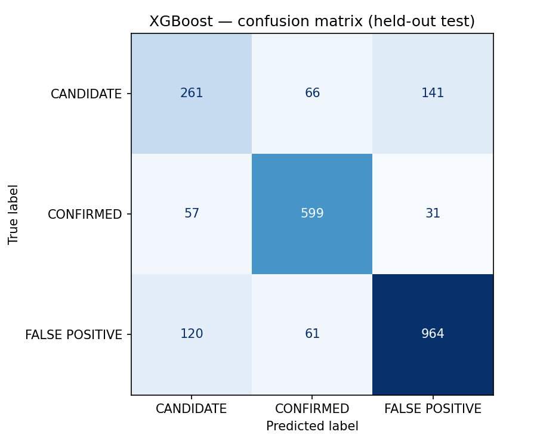
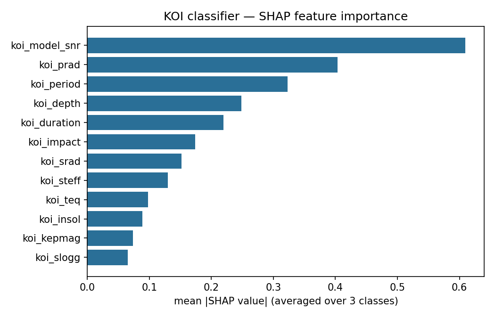
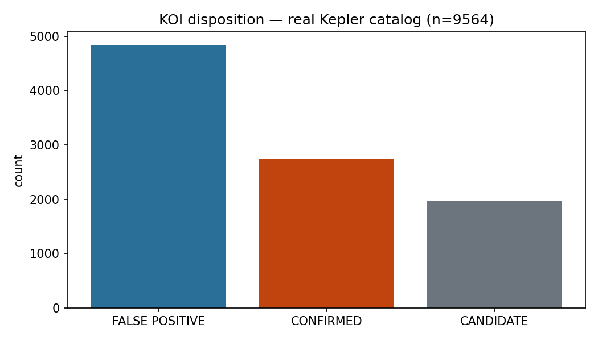

[ 🇺🇸 [Read in English](README.md) ] | [ 🇨🇱 Español ]

# hunting-exoplanets-kepler

Clasificación de **Kepler Objects of Interest (KOI)** — CONFIRMED / CANDIDATE / FALSE POSITIVE — sobre el catálogo real publicado por el **NASA Exoplanet Archive** (API pública, sin key). Mismo espíritu que `hunting-the-higgs-boson`: datos científicos reales, sin datos sintéticos, resultados honestos aunque no sean perfectos.

## Los datos

`src/data/fetch_koi.py` descarga en vivo la tabla `cumulative` vía la API TAP de NASA (`https://exoplanetarchive.ipac.caltech.edu/TAP/sync`) — **9,564 KOIs reales**, cada uno con su disposición real publicada tras vetting del pipeline de Kepler y/o revisión humana. Sin autenticación, sin dataset descargado a mano.

```bash
python -m src.data.fetch_koi
```

**Nota honesta sobre las features**: se usan solo parámetros de tránsito y estelares (`koi_period`, `koi_depth`, `koi_prad`, `koi_model_snr`, `koi_steff`, etc.) — deliberadamente se excluyen las columnas `koi_fpflag_*`, que son sub-decisiones del propio pipeline de vetting y filtrarían la etiqueta casi perfectamente. El objetivo es predecir la disposición desde la física observada, no desde el veredicto ya tomado.

## Tarea y modelos

```bash
python -m src.models.train              # baseline + XGBoost + SHAP
python -m src.models.torch_classifier    # ablación ReLU/GELU/Swish (PyTorch)
python -m src.visualization.plots        # genera los 4 gráficos de reports/figures/
```

| Modelo | Accuracy (holdout) | F1-macro |
|---|---|---|
| Baseline (clase mayoritaria) | 0.498 | 0.222 |
| PyTorch MLP (Swish) | 0.748 | 0.711 |
| PyTorch MLP (GELU) | 0.760 | 0.722 |
| PyTorch MLP (ReLU) | 0.763 | 0.722 |
| **XGBoost** | **0.793** | **0.756** |


**Hallazgo honesto**: XGBoost le gana a las tres variantes de MLP en este dataset tabular — consistente con la literatura de que los árboles de gradiente suelen superar a redes densas sobre features tabulares de tamaño moderado (9,200 filas, 12 features). Ninguna corrida de PyTorch se reporta como ganadora porque ninguna lo fue.



La clase `CANDIDATE` es la más difícil (F1=0.58) — y tiene sentido físico: es la clase de KOIs genuinamente no resueltos, ni confirmados ni descartados, así que es esperable que el modelo (y los propios astrónomos) tengan más incertidumbre ahí que en los casos ya zanjados.



`koi_model_snr` (razón señal-ruido del modelo de tránsito) domina — coherente con la intuición física: una señal de tránsito débil y ruidosa es la razón más común para que un KOI termine como falso positivo o quede sin resolver.



## Gráfico interactivo

`python -m src.visualization.interactive` genera un scatter interactivo (Plotly, HTML autocontenido) con las **2,300 predicciones reales del holdout**: periodo orbital vs. SNR del modelo de tránsito (ambos en escala log), coloreado por disposición real, con hover mostrando disposición real vs. predicha, profundidad de tránsito y radio del planeta. Los marcadores `X` son las predicciones incorrectas del propio modelo — se ve en vivo dónde falla, no solo el número agregado de accuracy.

**[Ver gráfico interactivo](https://htmlpreview.github.io/?https://github.com/Rxyxs/scientific-classification-lab/blob/main/02-exoplanet-transit-classification/outputs/interactive/koi_feature_space.html)**

## Técnicas utilizadas

- **Ingesta de datos real**: descarga en vivo vía la API TAP de NASA (`requests` + query SQL-like), sin dataset descargado a mano ni caché estático.
- **Feature engineering**: transformación `log1p` sobre 5 variables físicas con distribución muy sesgada (periodo, profundidad, radio, insolación, SNR) para que los modelos de árbol/red no queden dominados por outliers extremos; exclusión deliberada de las columnas `koi_fpflag_*` para evitar fuga de la etiqueta.
- **Modelado**: baseline de clase mayoritaria (`DummyClassifier`) → XGBoost multiclase (`multi:softprob`, 300 árboles, profundidad 5) → ablación de red neuronal PyTorch (ReLU/GELU/Swish, BatchNorm+Dropout, early stopping por val loss).
- **Explicabilidad**: SHAP (`TreeExplainer`) sobre el modelo XGBoost — no opcional, mandatorio para un caso de uso científico donde el "por qué" importa tanto como el accuracy.
- **Evaluación**: split estratificado 75/25 (`random_state=42`), accuracy + F1-macro (más informativo que accuracy solo, dado el desbalance entre las 3 clases), matriz de confusión y reporte de clasificación por clase.
- **Tests**: 6 tests de pytest, offline contra el parquet ya descargado, que verifican el reclamo central del repo (XGBoost supera al baseline) como aserción reproducible, no solo como número en el README.

## Tests

```bash
pytest
```

6 tests, todos offline contra el parquet ya descargado: labels reales verificados, ausencia de nulos post-limpieza, y el reclamo central del repo verificado como test reproducible (XGBoost supera al baseline por un margen real, no solo afirmado en el README).

## Instalación

```bash
python -m venv .venv
.venv\Scripts\pip install -r requirements.txt   # Windows
```

## Stack

Python · Polars · XGBoost · PyTorch · SHAP · scikit-learn · NASA Exoplanet Archive TAP API

## Autor

Pablo Reyes — Data Scientist, Santiago, Chile.
