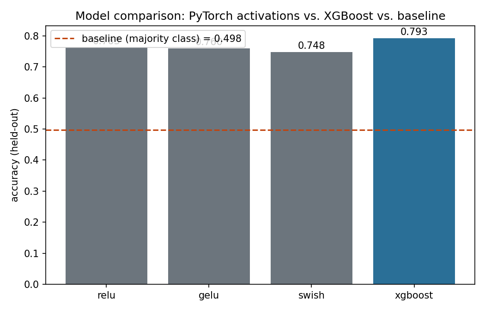
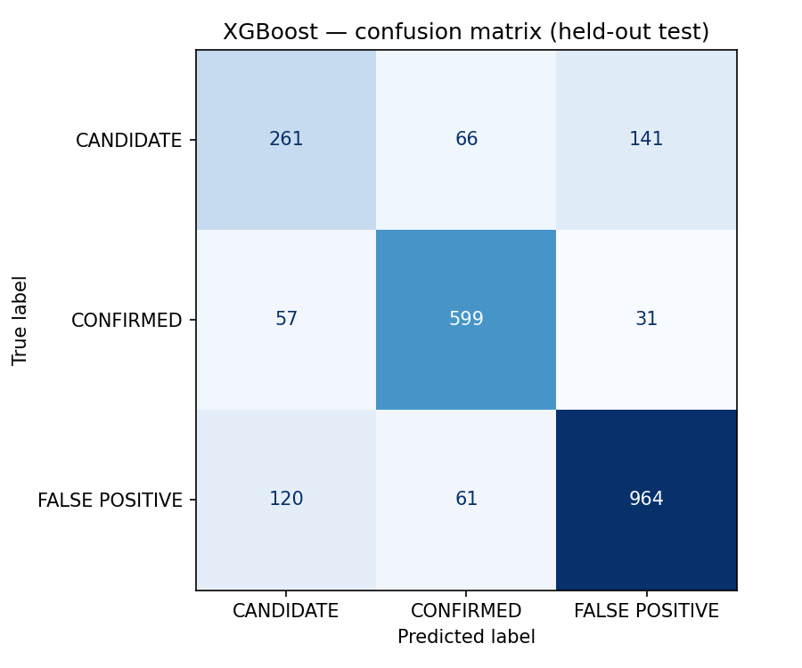
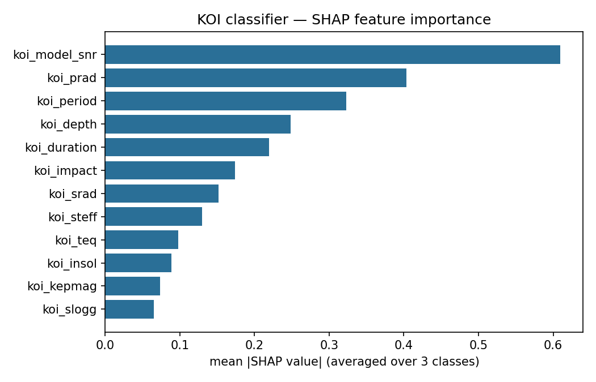
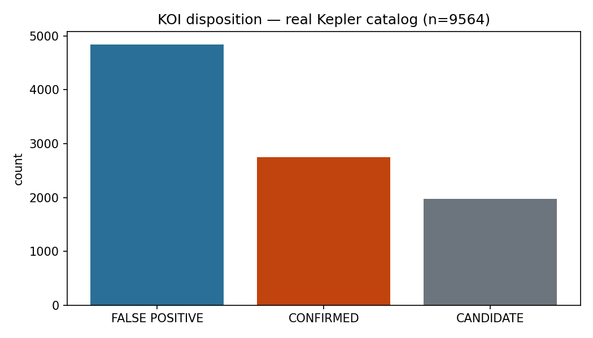

[ 🇨🇱 Versión en Español ](#-español) &nbsp;|&nbsp; [ 🇺🇸 English Version ](#-english)

---

<a name="-español"></a>
# hunting-exoplanets-kepler

Clasificación de **Kepler Objects of Interest (KOI)** — CONFIRMED / CANDIDATE / FALSE POSITIVE — sobre el catálogo real publicado por el **NASA Exoplanet Archive** (API pública, sin key). Mismo espíritu que `hunting-the-higgs-boson`: datos científicos reales, sin datos sintéticos, resultados honestos aunque no sean perfectos.

## Los datos

`src/data/fetch_koi.py` descarga en vivo la tabla `cumulative` vía la API TAP de NASA (`https://exoplanetarchive.ipac.caltech.edu/TAP/sync`) — **9,564 KOIs reales**, cada uno con su disposición real publicada tras vetting del pipeline de Kepler y/o revisión humana. Sin autenticación, sin dataset descargado a mano.

```bash
python -m src.data.fetch_koi
```

**Nota honesta sobre las features**: se usan solo parámetros de tránsito y estelares (`koi_period`, `koi_depth`, `koi_prad`, `koi_model_snr`, `koi_steff`, etc.) — deliberadamente se excluyen las columnas `koi_fpflag_*`, que son sub-decisiones del propio pipeline de vetting y filtrarían la etiqueta casi perfectamente. El objetivo es predecir la disposición desde la física observada, no desde el veredicto ya tomado.

## Tarea y modelos

```bash
python -m src.models.train              # baseline + XGBoost + SHAP
python -m src.models.torch_classifier    # ablación ReLU/GELU/Swish (PyTorch)
python -m src.visualization.plots        # genera los 4 gráficos de reports/figures/
```

| Modelo | Accuracy (holdout) | F1-macro |
|---|---|---|
| Baseline (clase mayoritaria) | 0.498 | 0.222 |
| PyTorch MLP (Swish) | 0.748 | 0.711 |
| PyTorch MLP (GELU) | 0.760 | 0.722 |
| PyTorch MLP (ReLU) | 0.763 | 0.722 |
| **XGBoost** | **0.793** | **0.756** |



**Hallazgo honesto**: XGBoost le gana a las tres variantes de MLP en este dataset tabular — consistente con la literatura de que los árboles de gradiente suelen superar a redes densas sobre features tabulares de tamaño moderado (9,200 filas, 12 features). Ninguna corrida de PyTorch se reporta como ganadora porque ninguna lo fue.



La clase `CANDIDATE` es la más difícil (F1=0.58) — y tiene sentido físico: es la clase de KOIs genuinamente no resueltos, ni confirmados ni descartados, así que es esperable que el modelo (y los propios astrónomos) tengan más incertidumbre ahí que en los casos ya zanjados.



`koi_model_snr` (razón señal-ruido del modelo de tránsito) domina — coherente con la intuición física: una señal de tránsito débil y ruidosa es la razón más común para que un KOI termine como falso positivo o quede sin resolver.



## Gráfico interactivo

`python -m src.visualization.interactive` genera un scatter interactivo (Plotly, HTML autocontenido) con las **2,300 predicciones reales del holdout**: periodo orbital vs. SNR del modelo de tránsito (ambos en escala log), coloreado por disposición real, con hover mostrando disposición real vs. predicha, profundidad de tránsito y radio del planeta. Los marcadores `X` son las predicciones incorrectas del propio modelo — se ve en vivo dónde falla, no solo el número agregado de accuracy.

**[Ver gráfico interactivo](https://htmlpreview.github.io/?https://github.com/Rxyxs/scientific-classification-lab/blob/main/02-exoplanet-transit-classification/outputs/interactive/koi_feature_space.html)**

## Técnicas utilizadas

- **Ingesta de datos real**: descarga en vivo vía la API TAP de NASA (`requests` + query SQL-like), sin dataset descargado a mano ni caché estático.
- **Feature engineering**: transformación `log1p` sobre 5 variables físicas con distribución muy sesgada (periodo, profundidad, radio, insolación, SNR) para que los modelos de árbol/red no queden dominados por outliers extremos; exclusión deliberada de las columnas `koi_fpflag_*` para evitar fuga de la etiqueta.
- **Modelado**: baseline de clase mayoritaria (`DummyClassifier`) → XGBoost multiclase (`multi:softprob`, 300 árboles, profundidad 5) → ablación de red neuronal PyTorch (ReLU/GELU/Swish, BatchNorm+Dropout, early stopping por val loss).
- **Explicabilidad**: SHAP (`TreeExplainer`) sobre el modelo XGBoost — no opcional, mandatorio para un caso de uso científico donde el "por qué" importa tanto como el accuracy.
- **Evaluación**: split estratificado 75/25 (`random_state=42`), accuracy + F1-macro (más informativo que accuracy solo, dado el desbalance entre las 3 clases), matriz de confusión y reporte de clasificación por clase.
- **Tests**: 6 tests de pytest, offline contra el parquet ya descargado, que verifican el reclamo central del repo (XGBoost supera al baseline) como aserción reproducible, no solo como número en el README.

## Tests

```bash
pytest
```

6 tests, todos offline contra el parquet ya descargado: labels reales verificados, ausencia de nulos post-limpieza, y el reclamo central del repo verificado como test reproducible (XGBoost supera al baseline por un margen real, no solo afirmado en el README).

## Instalación

```bash
python -m venv .venv
.venv\Scripts\pip install -r requirements.txt   # Windows
```

## Stack

Python · Polars · XGBoost · PyTorch · SHAP · scikit-learn · NASA Exoplanet Archive TAP API

## Autor

Pablo Reyes — Data Scientist, Santiago, Chile.

---

<a name="-english"></a>
# hunting-exoplanets-kepler (English)

Classifying **Kepler Objects of Interest (KOI)** — CONFIRMED / CANDIDATE / FALSE POSITIVE — on the real catalog published by **NASA's Exoplanet Archive** (public API, no key required). Same spirit as `hunting-the-higgs-boson`: real scientific data, no synthetic data anywhere, honest results even when they're not perfect.

## The data

`src/data/fetch_koi.py` downloads the `cumulative` table live via NASA's TAP API (`https://exoplanetarchive.ipac.caltech.edu/TAP/sync`) — **9,564 real KOIs**, each with its real published disposition after Kepler pipeline vetting and/or human review. No authentication, no hand-downloaded dataset.

```bash
python -m src.data.fetch_koi
```

**Honest note on features**: only transit and stellar parameters are used (`koi_period`, `koi_depth`, `koi_prad`, `koi_model_snr`, `koi_steff`, etc.) — the `koi_fpflag_*` columns are deliberately excluded, since they're sub-decisions of the vetting pipeline itself and would leak the label almost perfectly. The goal is predicting disposition from observed physics, not from the verdict already reached.

## Task and models

```bash
python -m src.models.train              # baseline + XGBoost + SHAP
python -m src.models.torch_classifier    # ReLU/GELU/Swish ablation (PyTorch)
python -m src.visualization.plots        # generates all 4 charts in reports/figures/
```

| Model | Accuracy (holdout) | F1-macro |
|---|---|---|
| Baseline (majority class) | 0.498 | 0.222 |
| PyTorch MLP (Swish) | 0.748 | 0.711 |
| PyTorch MLP (GELU) | 0.760 | 0.722 |
| PyTorch MLP (ReLU) | 0.763 | 0.722 |
| **XGBoost** | **0.793** | **0.756** |


**Honest finding**: XGBoost beats all three MLP variants on this tabular dataset — consistent with the well-known pattern that gradient-boosted trees tend to outperform dense networks on moderate-sized tabular features (9,200 rows, 12 features). No PyTorch run is reported as the winner because none was.


The `CANDIDATE` class is hardest (F1=0.58) — and that makes physical sense: it's the class of genuinely unresolved KOIs, neither confirmed nor ruled out, so it's expected that the model (and astronomers themselves) carry more uncertainty there than on already-settled cases.


`koi_model_snr` (transit-model signal-to-noise ratio) dominates — matches physical intuition: a weak, noisy transit signal is the most common reason a KOI ends up as a false positive or stays unresolved.


## Interactive chart

`python -m src.visualization.interactive` produces an interactive scatter (Plotly, self-contained HTML) of the **2,300 real holdout predictions**: orbital period vs. transit-model SNR (both log-scaled), colored by real disposition, with hover text showing real vs. predicted disposition, transit depth, and planet radius. `X` markers are the model's actual misclassifications — you can see live where it fails, not just the aggregate accuracy number.

**[View the interactive chart](https://htmlpreview.github.io/?https://github.com/Rxyxs/scientific-classification-lab/blob/main/02-exoplanet-transit-classification/outputs/interactive/koi_feature_space.html)**

## Techniques used

- **Real data ingestion**: live download via NASA's TAP API (`requests` + SQL-like query), no hand-downloaded dataset or static cache.
- **Feature engineering**: `log1p` transform on 5 heavily right-skewed physical quantities (period, depth, radius, insolation, SNR) so tree/NN models aren't dominated by extreme outliers; deliberate exclusion of `koi_fpflag_*` columns to avoid label leakage.
- **Modeling**: majority-class baseline (`DummyClassifier`) → multiclass XGBoost (`multi:softprob`, 300 trees, depth 5) → PyTorch MLP activation ablation (ReLU/GELU/Swish, BatchNorm+Dropout, early stopping on validation loss).
- **Explainability**: SHAP (`TreeExplainer`) on the XGBoost model — mandatory, not optional, for a scientific use case where "why" matters as much as accuracy.
- **Evaluation**: stratified 75/25 split (`random_state=42`), accuracy + F1-macro (more informative than accuracy alone given the 3-class imbalance), confusion matrix and per-class classification report.
- **Tests**: 6 pytest tests, offline against the already-downloaded parquet, that verify the repo's central claim (XGBoost beats the baseline) as a reproducible assertion, not just a README number.

## Tests

```bash
pytest
```

6 tests, all offline against the already-downloaded parquet: real labels verified, no nulls after cleaning, and the repo's central claim verified as a reproducible test (XGBoost beats the baseline by a real margin, not just asserted in the README).

## Installation

```bash
python -m venv .venv
.venv\Scripts\pip install -r requirements.txt   # Windows
```

## Stack

Python · Polars · XGBoost · PyTorch · SHAP · scikit-learn · NASA Exoplanet Archive TAP API

## Author

Pablo Reyes — Data Scientist, Santiago, Chile.
