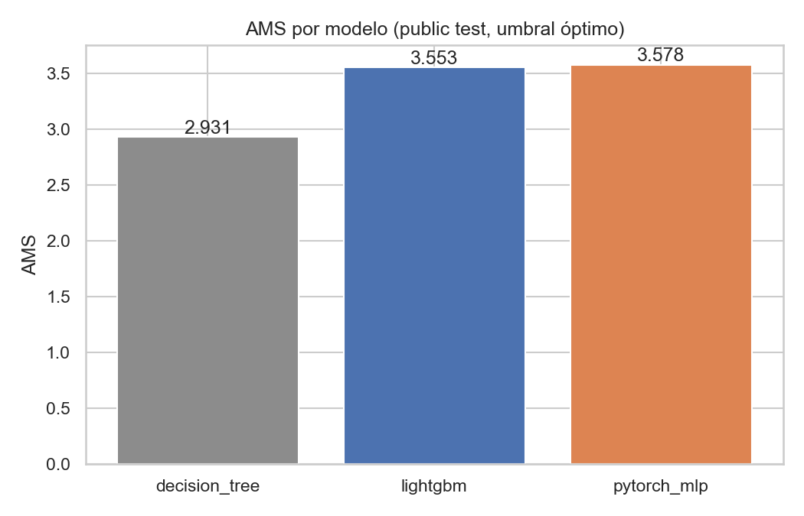
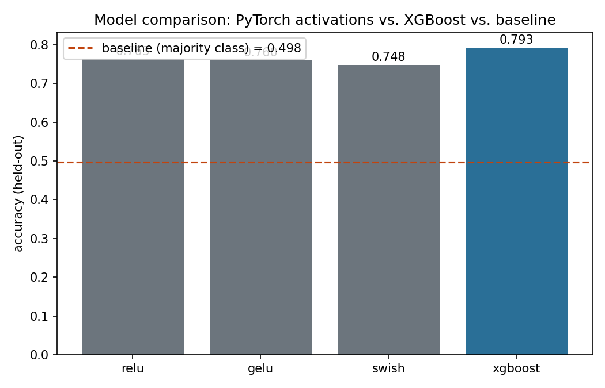

[ 🇺🇸 Read in English ](README.md) | [ 🇨🇱 Español ]

# Scientific Classification Lab

Dos problemas de clasificación en ciencias físicas, mismo enfoque central: extraer features específicas del dominio desde datos científicos crudos, y comparar un modelo con gradient boosting contra una red neuronal. Cada carpeta es autocontenida, con su propio README, dependencias y tests. Este repo reemplaza dos repos separados de un solo dominio que antes vivían en este perfil.

## Técnicas

| # | Dominio | Carpeta | Qué hace |
|---|---|---|---|
| 01 | Física de partículas (ATLAS/CERN) | [`01-higgs-boson-particle-classification`](01-higgs-boson-particle-classification) | Clasifica eventos de decaimiento Higgs-a-tau-tau vs. background a partir de variables cinemáticas: modelo con gradient boosting vs. red neuronal en PyTorch, evaluado con la métrica AMS, servido vía FastAPI. |
| 02 | Detección de exoplanetas (Kepler) | [`02-exoplanet-transit-classification`](02-exoplanet-transit-classification) | Clasifica Objetos de Interés Kepler como exoplanetas confirmados vs. falsos positivos a partir de features de la señal de tránsito. |

## Qué encontró cada uno de los dos proyectos

Los dos usan datos científicos reales con verdad terreno publicada — sin generación sintética, sin etiquetas simuladas. Todos los números provienen de una corrida real.

| # | Proyecto | Número principal | Qué dice en realidad |
|---|---|---|---|
| **01** | Bosón de Higgs (CERN/ATLAS, 818k eventos) | AMS **2,931 → 3,641** a lo largo de la iteración | Árbol de decisión → LightGBM → MLP de PyTorch → LightGBM ajustado con Optuna. La ganancia del ajuste se verifica sobre un **conjunto privado de 450.000 eventos jamás tocado durante la selección de modelo** (3,629, a 0,33% del valor del test público) |
| **01** | — misma carpeta | Los ganadores de Kaggle 2014 llegaron a AMS ≈ **3,8–3,9** | Dicho explícitamente. Este proyecto llega a 3,63–3,64 sin ensamblar nada, y lo reporta como el resultado de su iteración y no como un reclamo de paridad con el leaderboard |
| **01** | — misma carpeta | Verificación cruzada en Julia: **0,0000 de diferencia**, y una **meseta de umbral de 0,0235 de ancho** | Una implementación de AMS escrita desde cero en Julia coincide exactamente con Python. Su velocidad compra después un barrido de 2.000 umbrales que responde algo que el de 200 puntos en Python no puede: el óptimo es una **meseta ancha (0,7979–0,8214), no un filo de cuchillo** |
| **02** | Exoplanetas de Kepler (NASA, 9.564 KOIs reales) | XGBoost **0,793** de accuracy / **0,756** de F1-macro contra una línea base de clase mayoritaria de 0,498 | Descargados en vivo desde la API TAP pública de NASA, sin dataset manual y sin key |
| **02** | — misma carpeta | Columnas `koi_fpflag_*` **excluidas deliberadamente** | Esos flags son las sub-decisiones del propio pipeline de vetting de Kepler. Incluirlos predeciría la etiqueta a partir del veredicto en vez de la física observada — la decisión más consecuente del proyecto, y cuesta accuracy |
| **02** | — misma carpeta | `CANDIDATE` es la clase más difícil (F1 = **0,58**) | Y eso es físicamente correcto: es la clase de objetos genuinamente no resueltos, donde los propios astrónomos tampoco se habían decidido |

---

## Evidencia

### Iteración sobre un problema real de física, y dónde se detiene

**Cómo leerla.** AMS (Approximate Median Significance) sobre el test público, con el umbral óptimo de cada modelo — la métrica oficial del desafío ATLAS 2014, no la accuracy. Más alto es mejor. Las tres barras son la comparación sin ajustar; el LightGBM ajustado con Optuna que llega a 3,641 no está en esta figura.

El salto que importa es el primero: de un árbol de decisión en 2,931 a LightGBM en 3,553, un 21% de ganancia. Después los retornos se aplanan — **el MLP de PyTorch en 3,578 le gana a LightGBM por 0,025**, una diferencia lo bastante chica como para reportarse en sustancia como empate y no como triunfo de la red neuronal. El ajuste suma después 0,088 sobre LightGBM, y esa ganancia se confirma sobre un conjunto privado que nunca se usó para seleccionar.

El techo honesto está dicho en vez de escondido: los ganadores del desafío en 2014 llegaron a aproximadamente 3,8–3,9 con ensambles fuertemente ajustados. Este proyecto llega a 3,63–3,64 sin ensamblar nada.

### Sobre datos tabulares, la red neuronal no es automáticamente la respuesta

**Cómo leerla.** Accuracy en holdout sobre 9.564 Kepler Objects of Interest reales, tres clases (CONFIRMED / CANDIDATE / FALSE POSITIVE). La línea punteada en 0,498 es la línea base de clase mayoritaria — cualquier cosa por debajo es peor que adivinar la respuesta más común. Tres activaciones de PyTorch en gris, XGBoost en azul. *(La caja de leyenda tapa parcialmente las etiquetas de ReLU y GELU; sus valores son 0,763 y 0,760, según la tabla de resultados de la carpeta.)*

XGBoost gana con 0,793 contra el mejor MLP en 0,763. Junto con la figura de Higgs de arriba, el par hace un punto que ninguna hace sola: sobre 818k eventos de física la red empata con los árboles con gradiente, y sobre 9.564 KOIs tabulares les pierde. Ninguno de los dos resultados se disfraza de veredicto sobre deep learning — las carpetas reportan lo que produjo cada corrida y señalan el tamaño y la forma del dataset como la razón probable.

---

## El patrón que cruza los dos

Dos problemas de dos ciencias, y una disciplina compartida:

> **El resultado lo define lo que se dejó afuera.**

- **02 excluye las columnas `koi_fpflag_*`.** Habrían predicho la disposición casi perfectamente, porque *son* los veredictos intermedios del pipeline de vetting. Mantenerlas habría producido un número mucho mejor y un modelo inútil. El proyecto predice desde la física de tránsito y estelar observada, y lo paga en accuracy.
- **01 excluye el conjunto de prueba privado de toda decisión de selección**, y recién después lo usa una vez para comprobar que una ganancia de 40 trials de Optuna era real y no estaba ajustada a la propia búsqueda.
- **01 también rechaza el encuadre cómodo.** Llegar a 3,63 se reporta al lado del 3,8–3,9 que lograron los ganadores de 2014, no solo.
- **Ninguno de los dos reporta una red neuronal como ganadora donde no lo fue.** En 01 la ventaja de 0,025 del MLP sobre el LightGBM sin ajustar se trata como empate; en 02 XGBoost simplemente gana y eso es lo que dice la carpeta.

El resultado de la clase `CANDIDATE` es la ilustración más clara de por qué esto importa. Su F1 de 0,58 parece el punto más débil del modelo hasta que uno nota qué es esa clase: KOIs que el propio proceso de vetting de Kepler dejó sin resolver. Un modelo que sacara 0,95 ahí sería motivo de desconfianza.

---

## Por qué un repo en vez de dos

Ambos proyectos son reales, ejecutables y probados de forma independiente — esto no es esconder alcance, es representarlo con precisión. Dos repos en dos dominios que suenan sin relación (física de partículas, astronomía) esconden el hecho de que comparten la misma técnica central — ingeniería de features desde mediciones científicas crudas hacia un clasificador supervisado, GBM vs. red neuronal comparados cara a cara; un laboratorio hace de ese método compartido el punto real.

## Cómo correr una técnica

Cada carpeta es autocontenida — ver su propio README para el setup exacto y el entry point, resultados reales de una corrida real, y cualquier hallazgo negativo honesto.

## Autor

Pablo Reyes — [github.com/Rxyxs](https://github.com/Rxyxs)
Código: MIT — ver [LICENSE](LICENSE)
